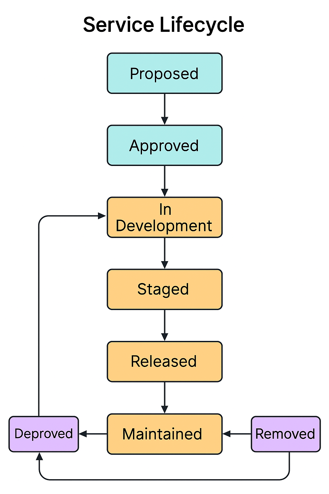

### 📘 `docs/architecture/lifecycle.md` — Service & Feature Lifecycle

# 🔁 Service Lifecycle – Bluewater Framework

📄 **File:** `docs/architecture/lifecycle.md`  
📅 **Status:** Active  
🏷️ **Tags:** lifecycle, services, feature-flags, rollout  
🔖 **Version:** 1.0  
🌍 **Scope:** Define the full lifecycle for Bluewater services and platform features—from inception through deployment, operation, and deprecation  
🤝 **Contributors:** – Service developers, product owners, release managers, SREs  
👨‍💻 **Author:** Walter Torres

---

> ### 🪶 **Bluewater Principle**
> *Every service should live intentionally, evolve incrementally, and retire gracefully.*

---

## 📌 Purpose

This document outlines the structured lifecycle for services and features in the Bluewater ecosystem. It provides a clear governance model for proposing, implementing, evolving, and retiring functional or infrastructural elements.

---

Here is the updated **Lifecycle Stages** table for `docs/architecture/lifecycle.md`, now with icons for each stage:

---

## 🚦 Lifecycle Stages

| Stage              | Icon | Description                                 | Entry Criteria                       |
|--------------------|------|---------------------------------------------|--------------------------------------|
| **Proposed**       | 📝   | RFC drafted, not yet approved               | RFC filed and reviewed               |
| **Approved**       | ✅    | Design approved, ready for development      | RFC accepted or fast-tracked         |
| **In Development** | 🔧   | Active build or integration in progress     | Dev tasks started, design validated  |
| **Staged**         | 🚧   | Deployed to UAT/staging behind feature flag | CI/CD deploy complete, test access   |
| **Released**       | 🚀   | Fully deployed and active in production     | Feature flag enabled or public docs  |
| **Maintained**     | 🛠️  | Actively supported, monitored, and patched  | Error budgets tracked, observability |
| **Deprecated**     | ⚠️   | Planned for sunset, users notified          | Users notified, successors defined   |
| **Removed**        | 🗑️  | Fully shut down or deleted                  | Cleanup validated, logs archived     |

---

Let me know if you’d like a matching legend graphic for use in slide decks or summary tables.

---

## 📊 Feature Rollout Controls

All new features must be controlled via:

- Feature toggles (env or config-driven)
- Canary or phased rollout gates
- Environment-specific exposure
- Logging and metrics collection

Toggle metadata should include:
- Description, owner, expiration, type (boolean, gradual)

---

## 🔐 Service Runtime Lifecycle

1. **Boot**: Load config, inject secrets, hydrate dependencies
2. **Ready**: Pass health + readiness probes
3. **Live**: Serve requests or consume events
4. **Recover**: Handle errors, restarts, graceful shutdown
5. **Retire**: Exit cleanly, offload pending tasks, flush logs

<!-- Diagram: service-lifecycle-overview -->

---

## 🧭 Change Governance

- Any public contract change requires RFC
- Breaking changes must have migration notes
- Internal-only services can skip deprecation with clear tagging
- Logs must indicate version and lifecycle state

---

## 🧪 Observability Expectations by Stage

| Stage       | Metrics  | Tracing | Logging   | Alerts   |
|-------------|----------|---------|-----------|----------|
| Proposed    | ❌        | ❌       | ❌         | ❌        |
| Development | ✅ (mock) | ❌       | ✅ (local) | ❌        |
| Staged      | ✅        | ✅       | ✅         | Optional |
| Released    | ✅        | ✅       | ✅         | ✅        |
| Deprecated  | ✅        | ✅       | ✅ (warn)  | ✅        |
| Removed     | ❌        | ❌       | ❌         | ❌        |

---

## 📚 Related Documents

- [Deployment Strategy](deployment.md)
- [Service Architecture](services.md)
- [Observability](observability.md)
- [RFC Process](../rfc/README.md)  
