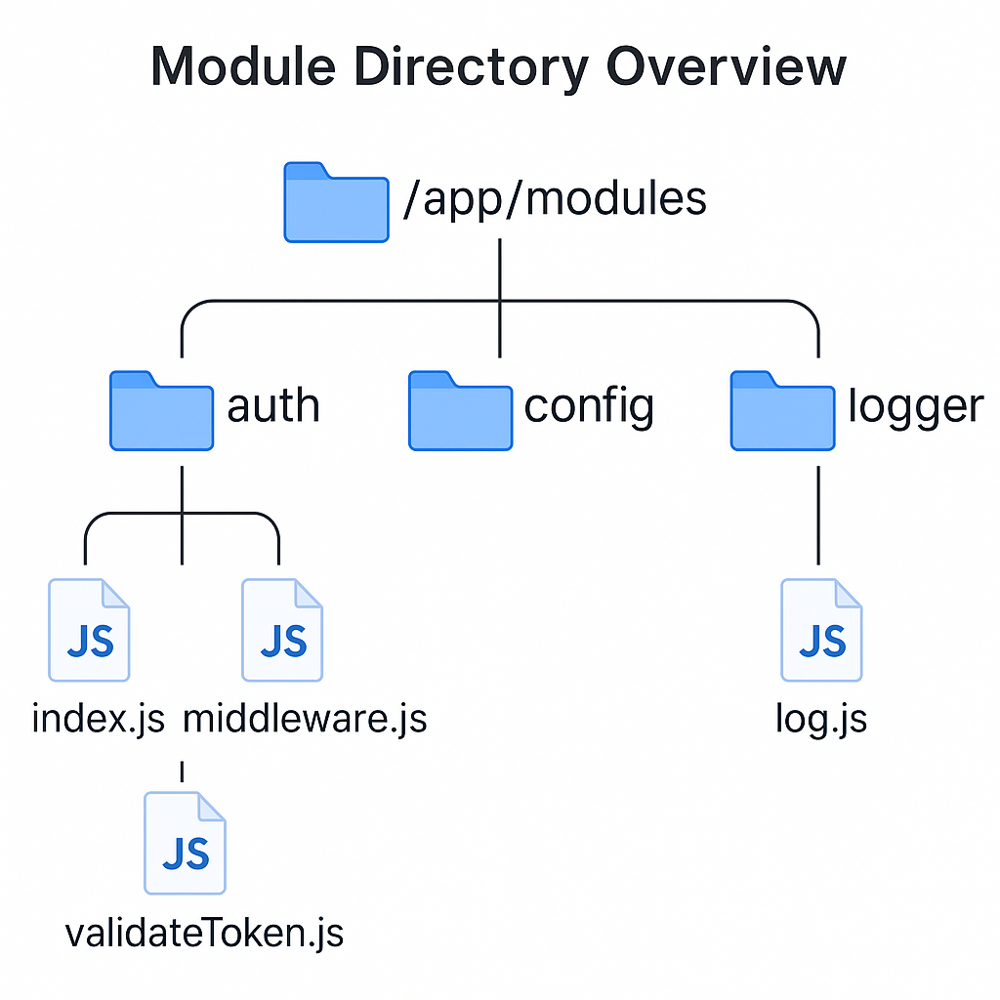
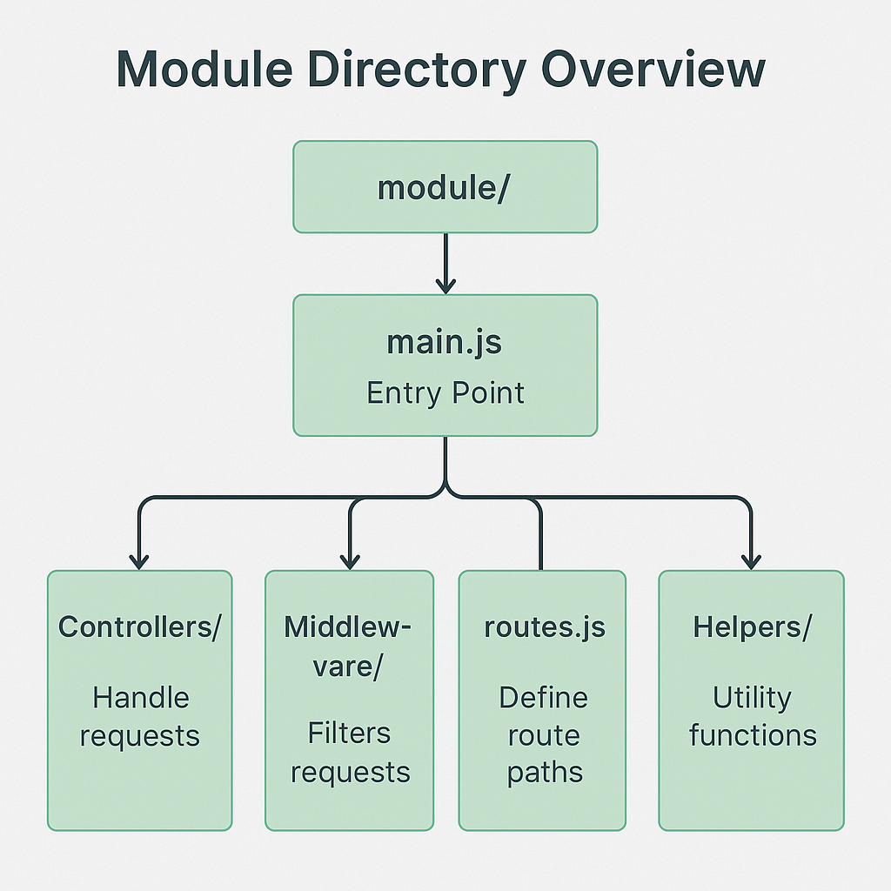

### 📘 `docs/architecture/modules.md` — Module Architecture

# 🧩 Module Architecture – Bluewater Framework

📄 **File:** `docs/architecture/modules.md`  
📅 **Status:** Draft  
🏷️ **Tags:** modules, reuse, extension  
🔖 **Version:** 0.1  
🌍 **Scope:** Define the structure, purpose, and extensibility of reusable modules in the Bluewater Framework  
🤝 **Contributors:** – Developers building core features or customizing service logic via shared modules  
👨‍💻 **Author:** Walter Torres  

---

> ### 🪶 **Bluewater Principle**  
> *Modules should be swappable, self-contained, and minimal in obligation.*

---

## 📌 Purpose

This document outlines how modular logic is packaged, structured, and consumed within the Bluewater Framework. It emphasizes clean boundaries, dependency awareness, and extensibility without duplication.

---

## 🧱 What Is a Module?

A **module** is a self-contained package of logic that can be reused across services.

Examples:
- `auth-module`: Token validation, middleware
- `config-module`: Environment configuration loader
- `logger-module`: Structured logging and metrics

Modules may export:
- Functions
- Classes
- Middleware
- Configuration blocks

---

## 🗂️ Directory Structure & Naming

All shared modules reside in:

```txt
/app/modules/
├── auth/
│   ├── index.js
│   ├── middleware.js
│   └── validateToken.js
├── config/
│   └── loadConfig.js
└── logger/
    └── log.js
````

Each module must export a single entrypoint (`index.js`) and encapsulate internal helpers.

<!-- Diagram: module-directory-overview -->



---

## 🔗 Dependencies and Isolation

Each module should:

* Explicitly declare its dependencies
* Avoid importing from sibling modules directly
* Accept injected configs where needed

Never cross-link modules implicitly:

```js
// ❌ Bad
require('../logger/log.js');

// ✅ Good
const logger = require('logger-module');
```

---

## 🧬 Usage Within Services

Modules are imported and wired during service bootstrap:

```js
const config = require('config-module');
const auth = require('auth-module');

app.use(auth.middleware);
const port = config.port || 3000;
```

Services may override configs using `.env` or dependency injection.

---

## 🔄 Extension and Overrides

Modules should be overrideable via:

* Environment-based config
* Optional plug-in hooks (e.g., `registerPlugin`)
* Swappable interfaces

For example:

```js
auth.useCustomTokenParser(customFn);
```

Module behavior must remain predictable when extended.

---

## 🧪 Testability and Contracts

Modules must:

* Include unit tests for all exported methods
* Avoid global state
* Validate inputs and fail safely

Exported APIs should be treated as versioned contracts.

---

## 📚 Example: `auth-module`

* `middleware.js`: Validates token in request
* `validateToken.js`: Decodes and verifies JWT
* `index.js`: Wires up exportable methods
* Allows injection of a custom `issuer` or verification secret

---

## 🧠 Design Considerations

* Keep modules small and focused
* Abstract only what's reused or repeated
* Don’t force every feature to be modular — value over abstraction

<!-- Diagram: module-extension-lifecycle -->



---

## 📚 Related Documents

* [Component Responsibilities](components.md)
* [Service Architecture](services.md)
* [Security Architecture](security.md)

---
