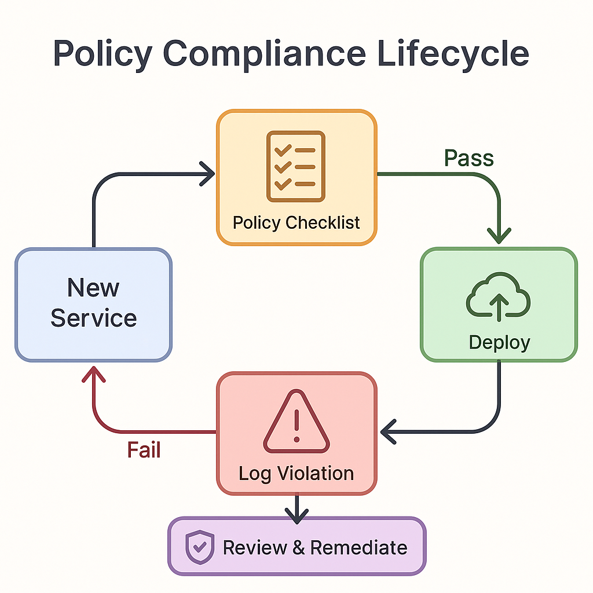

### 📘 `docs/architecture/policies.md` — Platform Policies

# 📜 Platform Policies – Bluewater Framework

📄 **File:** `docs/architecture/policies.md`  
📅 **Status:** Draft  
🏷️ **Tags:** compliance, security, data, policies  
🔖 **Version:** 0.1  
🌍 **Scope:** Define platform-wide operational, data, and compliance policies to guide development, deployment, and usage of the Bluewater Framework  
🤝 **Contributors:** – Platform leads, DevOps, legal/compliance, data governance teams  
👨‍💻 **Author:** Walter Torres  

---

> ### 🪶 **Bluewater Principle**  
> *Policies exist to protect freedom, not restrict it — they guard against chaos, not creativity.*

---

## 📌 Purpose

This document defines high-level policies that govern the operation, security, retention, compliance, and lifecycle of services and data across the Bluewater Framework. These policies support consistent, secure, and compliant behavior across teams and environments.

---

## 🛡️ Security Policies

- All services must implement token-based authentication (JWT or OAuth2)
- Services must validate authorization at their own boundary
- Secrets must never be hardcoded or stored in source control
- Production secrets must be rotated regularly and audited

---

## 🧠 Data Retention & Handling

| Data Type        | Retention Period       | Storage Rule                      |
|------------------|------------------------|-----------------------------------|
| Access Logs      | 90 days                | Redacted, encrypted at rest       |
| Application Logs | 30 days                | Partitioned per environment       |
| User PII         | Until account deletion | Encrypted, tenant-isolated        |
| Audit Trails     | 12 months              | Immutable and queryable by admins |

PII must be redacted from logs by default. Exported data must be encrypted.

---

## 📜 Compliance Requirements

- All APIs that handle PII must require token-based access
- Webhook endpoints must validate origin and payload signature
- User-facing actions must be logged with `user_id`, `ip`, and `timestamp`
- All production environments must support on-demand audit trails

---

## ♻️ Backup & Disaster Recovery

- All data stores must support daily automated backups
- Backups must be stored encrypted and off-site
- Restore procedures must be tested quarterly
- Service state (e.g., job queues) must be replayable after crash

---

## 🔁 Code & Configuration Policy

- All services must define config via environment variables
- Environment files must follow the `.env.schema` standard
- Code must pass linting and tests before merging
- Feature toggles must support rollout per tenant or environment

---

## 👥 Access Control

- Least privilege must be enforced for all internal tools and dashboards
- Audit logs of permission changes must be retained for 6 months
- Admin tools must enforce 2FA and IP whitelisting

---

## ⚙️ Policy Enforcement & Governance

- Policies are documented and versioned under `/docs/architecture/policies.md`  
- Each new service must pass a “policy compliance checklist”  
- Violations must be logged, reviewed, and tracked  
- Exceptions must be approved via RFC and logged by platform governance  

---

## 📚 Related Documents

- [Security Architecture](security.md)  
- [Secrets & Config Management](secrets.md)  
- [Deployment Strategy](deployment.md)  
- [Testing Architecture](testing.md)  

---
