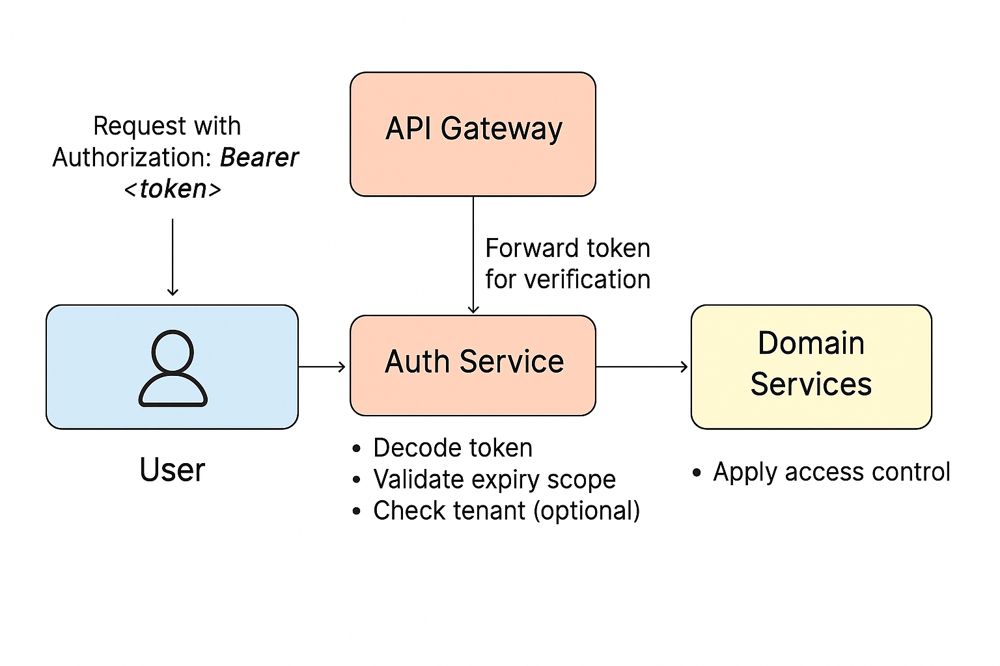

### 📘 `docs/architecture/security.md` — Security Architecture

# 🔐 Security Architecture – Bluewater Framework

📄 **File:** `docs/architecture/security.md`  
📅 **Status:** Draft  
🏷️ **Tags:** security, auth, architecture  
🔖 **Version:** 0.1  
🌍 **Scope:** Define the security architecture and guiding principles of the Bluewater Framework, covering authentication, authorization, tenant isolation, and secret management  
🤝 **Contributors:** – Developers, DevOps, and security engineers designing and implementing secure systems  
👨‍💻 **Author:** Walter Torres  

---

> ### 🪶 **Bluewater Principle**  
> *Security must be seamless and strong — it should support agility, not slow it down.*

---

## 📌 Purpose

This document defines the security architecture for the Bluewater Framework. It describes authentication mechanisms, authorization models, tenant-aware protections, and operational security strategies to ensure a secure multi-tenant API platform.

---

## 🔐 Authentication Strategy

### Centralized Auth Service

All identity validation is handled by a dedicated `auth-service`. It issues and verifies access tokens, serving as the single point of trust.

### Token Model

- **Type**: JWT (JSON Web Tokens)
- **Transport**: `Authorization: Bearer <token>`
- **Contents**:
  - `sub`: user ID
  - `iss`: token issuer (optional per-tenant)
  - `exp`: expiration
  - `scope`: permission scope
  - `tenant`: (if multi-tenant mode enabled)

### Token Lifecycle

1. User authenticates via login endpoint  
2. Auth-service returns signed token  
3. Token used in each request via `Authorization` header  
4. Gateway validates token; optionally passes context to downstream services  

---

## 🔓 Authorization and Access Control

### Strategy

Authorization is **role-based** and optionally **tenant-scoped**. Roles include:

- `admin`
- `user`
- `viewer`

Each role maps to an access policy. Policies are enforced at the service level.

### Tenant Awareness

In multi-tenant mode:
- Tokens must contain `tenant`
- APIs validate token-tenant against resource-tenant
- Deny access if mismatch occurs

---

## 🔄 Token Flow (Request Lifecycle)

1. Request arrives at API Gateway with `Authorization` token  
2. Gateway forwards token to `auth-service` for verification  
3. Token is decoded and validated (expiry, scope, tenant)  
4. Validated context is forwarded downstream as headers or claims  
5. Domain services apply access control logic before executing any business logic  

---

## 🔄 Token Flow (Request Lifecycle)

1. Request arrives at API Gateway with `Authorization` token  
2. Gateway forwards token to `auth-service` for verification  
3. Token is decoded and validated (expiry, scope, tenant)  
4. Validated context is forwarded downstream as headers or claims  
5. Domain services apply access control logic before executing any business logic  

---

## 🛡️ Service Boundary Enforcement

Every service must:
- Validate inbound tokens (unless gateway injects trusted context)
- Enforce tenant isolation where applicable
- Reject unauthorized or malformed requests immediately

---

## 🔑 Secret & Config Management

### Development

- `.env` files are used locally
- Kept out of version control via `.gitignore`

### Production

- Secrets managed via platform tools (Vault, AWS SSM, Doppler, etc.)
- Mounted at runtime or injected as environment variables

### Common Secrets

- Auth token signing key  
- Database credentials  
- Tenant-level keys (if unique)  

---

## ✅ Best Practices

- Never trust incoming tenant headers without verifying against token  
- Always validate JWT tokens at entry points  
- Rotate secrets and keys regularly  
- Limit token scope and expiration for high-risk actions  
- Audit logs for sensitive operations (auth, config changes)  

---

## 📚 Related Documents

- [Multi-Tenant Architecture](multi-tenant.md)  
- [Deployment Strategy](deployment.md)  
- [Component Responsibilities](components.md)  

---
