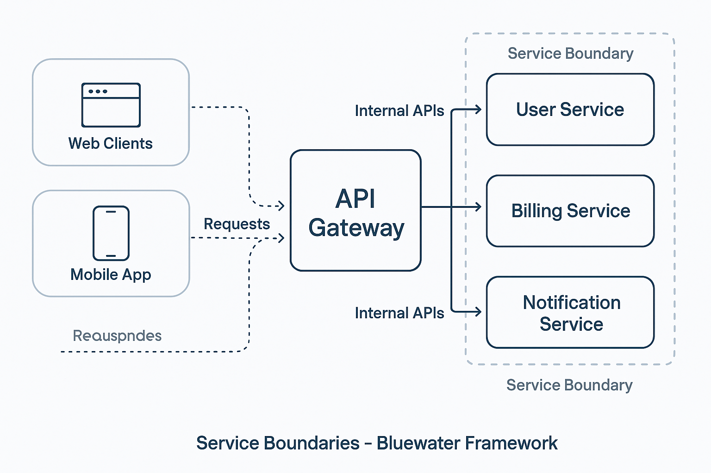
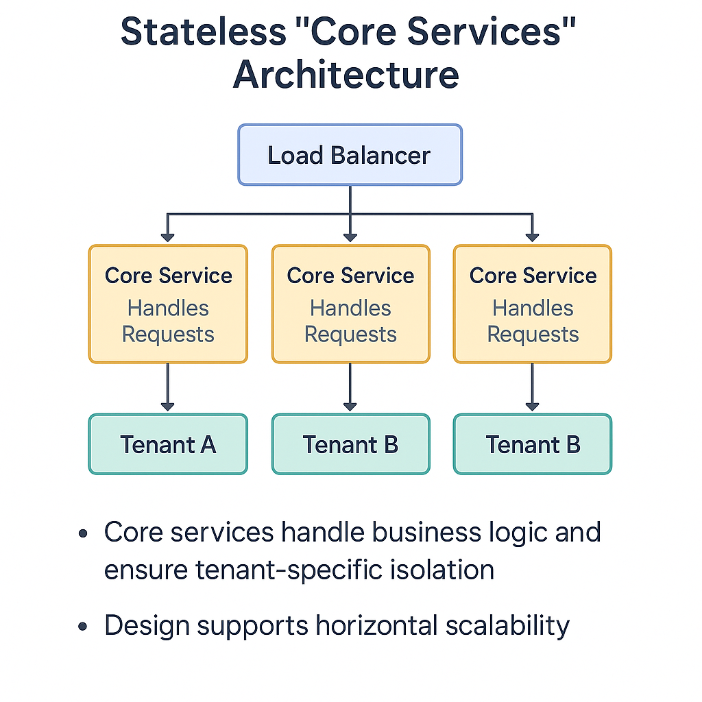

### 📘 `docs/architecture/services.md` — Service Architecture

# 📦 Service Architecture – Bluewater Framework

📄 **File:** `docs/architecture/services.md`  
📅 **Status:** Draft  
🏷️ **Tags:** services, architecture, lifecycle  
🔖 **Version:** 0.1  
🌍 **Scope:** Define how services are structured, initialized, and extended within the Bluewater Framework, including lifecycles, boundaries, and internal communication  
🤝 **Contributors:** – Developers and architects building or integrating services  
👨‍💻 **Author:** Walter Torres  

---

> ### 🪶 **Bluewater Principle**  
> *Services should be self-contained, contract-bound, and replaceable without friction.*

---

## 📌 Purpose

This document describes how services are designed, organized, and operated in the Bluewater Framework. It includes lifecycle stages, conventions, communication methods, and extensibility mechanisms that promote modularity and maintainability.

---

## 🧩 Service Boundaries

Each service is independently deployed, versioned, and tested. A service should:
- Own its own data and business logic  
- Expose internal APIs only when needed  
- Be stateless wherever possible  

Boundaries align with domain logic — not technical functions.



---

## 🔄 Startup Lifecycle

Typical service initialization includes:

1. Load configuration and secrets  
2. Register internal modules and routes  
3. Connect to dependencies (e.g., DB, cache, queue)  
4. Run health checks  
5. Begin listening for traffic  

Use a framework bootstrap layer (`/boot`, `/init`) for repeatable service scaffolding.

---

## 🌐 Communication Models

### HTTP (Synchronous)
- Used for service APIs, gateway requests, and admin UIs

### Events (Asynchronous)
- Used for decoupled workflows, e.g., "user.created"  
- Backed by RabbitMQ, NATS, Kafka (future)

Services should support both methods where appropriate.

---

## 🔍 Internal vs. External Interfaces

- **External API**: Public-facing (via gateway), versioned, documented  
- **Internal API**: Private RPC or REST for internal service interactions  

Use `/__internal` or dedicated ports to prevent accidental exposure.

---

## 🧱 Extension & Plugin Hooks

Services may offer:
- Middleware registration  
- Hook/event emitters  
- Configurable modules  

Examples:
```js
auth.useCustomTokenParser(customFn);
````

Module behavior must remain predictable when extended.

---

## 📈 Health, Metrics, and Lifecycle

Every service must expose:

* `/health` → readiness and liveness
* `/metrics` → Prometheus-style endpoint
* `/info` → build version, uptime, etc.

Integrate with the observability pipeline (e.g., Prometheus, Grafana, ELK).

---

## 🔗 Service-to-Service Contracts

Each service must define:

* What it consumes and provides
* Error and timeout behavior
* Fallback or retry policies

Use open contracts and documented request schemas for predictability.



---

## 🛑 Fault Tolerance & Isolation

* Circuit breakers for outbound calls
* Bulkheads for high-load operations
* Retries with exponential backoff
* Fallback paths where safe

Avoid cascading failures through tight coupling.

---

## 📚 Related Documents

* [Component Responsibilities](components.md)
* [API Architecture](api.md)
* [Deployment Strategy](deployment.md)
* [Security Architecture](security.md)

---
