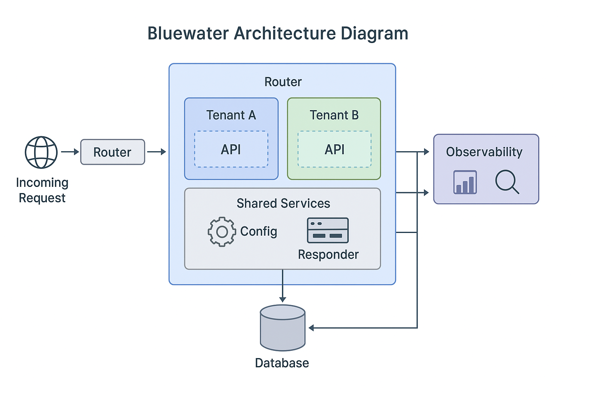

# System Overview

This document provides a high-level view of the Bluewater system architecture. It introduces the platform’s core components, design principles, and how data and responsibilities flow across services. It’s intended for developers, architects, and DevOps engineers who want to understand how the pieces fit together — before diving into specific subsystems.

---

## 🧱 Architectural Philosophy

Bluewater is built on modular, containerized services deployed in a cloud-native environment. Its architecture is designed around the following principles:

- **Separation of Concerns**: Each service has a focused responsibility and clearly defined API.
- **Scalability**: Services are independently deployable and horizontally scalable.
- **Multi-Tenancy**: Tenant isolation is enforced at the database and API layers.
- **Security by Default**: Access is managed via centralized RBAC and tokenized auth flows.
- **Observability**: Metrics, logs, and traces are emitted across all services.

---

## 🔧 Core System Components

| Component            | Role / Description                                                                  |
|----------------------|-------------------------------------------------------------------------------------|
| **API Gateway**      | Entry point for external traffic. Handles routing, throttling, and authentication.  |
| **Auth Service**     | Issues and validates JWT tokens; manages user/tenant identities and roles.          |
| **Core Modules**     | Stateless service containers implementing business logic per bounded context.       |
| **Job Worker**       | Asynchronous job processor handling queues, retries, and scheduled tasks.           |
| **Storage Layer**    | PostgreSQL and Redis-based persistent and ephemeral storage solutions.              |
| **Event Bus**        | Pub/sub communication layer (e.g. NATS, Kafka) for decoupled service communication. |
| **Monitoring Stack** | Includes Prometheus, Grafana, and Loki for metrics, dashboards, and logs.           |

> For a deeper dive into the modules, see [`Core Modules`](../core/core-modules.md)

---

---

## 🏗 Infrastructure Layers

Bluewater runs in a fully containerized, cloud-native environment. The platform is provisioned using Terraform and deployed onto a Kubernetes cluster. The infrastructure can be visualized in layered form:

| Layer                       | Technology Stack                    | Description                                                                 |
|-----------------------------|-------------------------------------|-----------------------------------------------------------------------------|
| **Platform Provisioning**   | Terraform, Helm                     | Defines and manages infrastructure-as-code (IaC) for repeatable deployments |
| **Compute Orchestration**   | Kubernetes                          | Schedules, scales, and monitors all service containers                      |
| **Service Mesh (optional)** | Istio or Linkerd                    | Manages internal service discovery, routing, retries, and encryption        |
| **Ingress Layer**           | NGINX Ingress Controller            | Terminates HTTPS, manages routing and load balancing to API Gateway         |
| **Observability Stack**     | Prometheus, Grafana, Loki           | Metrics, dashboards, log aggregation, and alerting                          |
| **Storage & State**         | PostgreSQL, Redis, S3 (or MinIO)    | Persistent data stores for services and queues                              |
| **Secrets Management**      | HashiCorp Vault, Kubernetes Secrets | Stores environment variables, credentials, and encryption keys              |

📌 Most of these layers are explained in the [Deployment Strategy](deployment.md) and [Infrastructure Guide](../deployment/infrastructure.md).

📌 Configuration details are documented in the [Runtime Configuration Guide](../configuration/runtime.md).

### 🛠 Example Infrastructure Flow

1. **Terraform** provisions cloud resources like databases, object storage, and Kubernetes clusters.
2. **Helm** applies Bluewater’s Helm charts to deploy services into namespaces.
3. **Kubernetes** schedules and runs containers for each microservice and system pod.
4. **NGINX Ingress** routes traffic from the internet to the internal API Gateway.
5. **Service Mesh (if enabled)** routes internal requests and applies observability policies.
6. **Monitoring Stack** captures logs and metrics from all services.
7. **Secrets** are injected into pods securely at runtime.

---

## 📊 System Diagram

> This diagram illustrates service boundaries, API flows, and infrastructure layers.  
> It follows the north-south (external-internal) request pattern and east-west (service-to-service) interactions.

---

## 🔁 Typical Request Flow

1. **User logs in** via the UI or CLI. Auth Service issues a token.
2. **API Gateway** receives a request, verifies the token, and routes to the correct service.
3. **Core Service** handles business logic and persists data via the storage layer.
4. If needed, **Event Bus** sends messages for async processing by job workers.
5. All activity is logged and monitored through the observability stack.

---

## 🔗 Next Steps

- [Deployment Guide](../deployment/deployment-guide.md): See how this system is provisioned and deployed.
- [Core Modules](../core/): Explore how services are organized and extended.
- [Security Overview](../security/): Understand auth, RBAC, and tenant isolation.

---

_Last updated: 2025-06-05_
