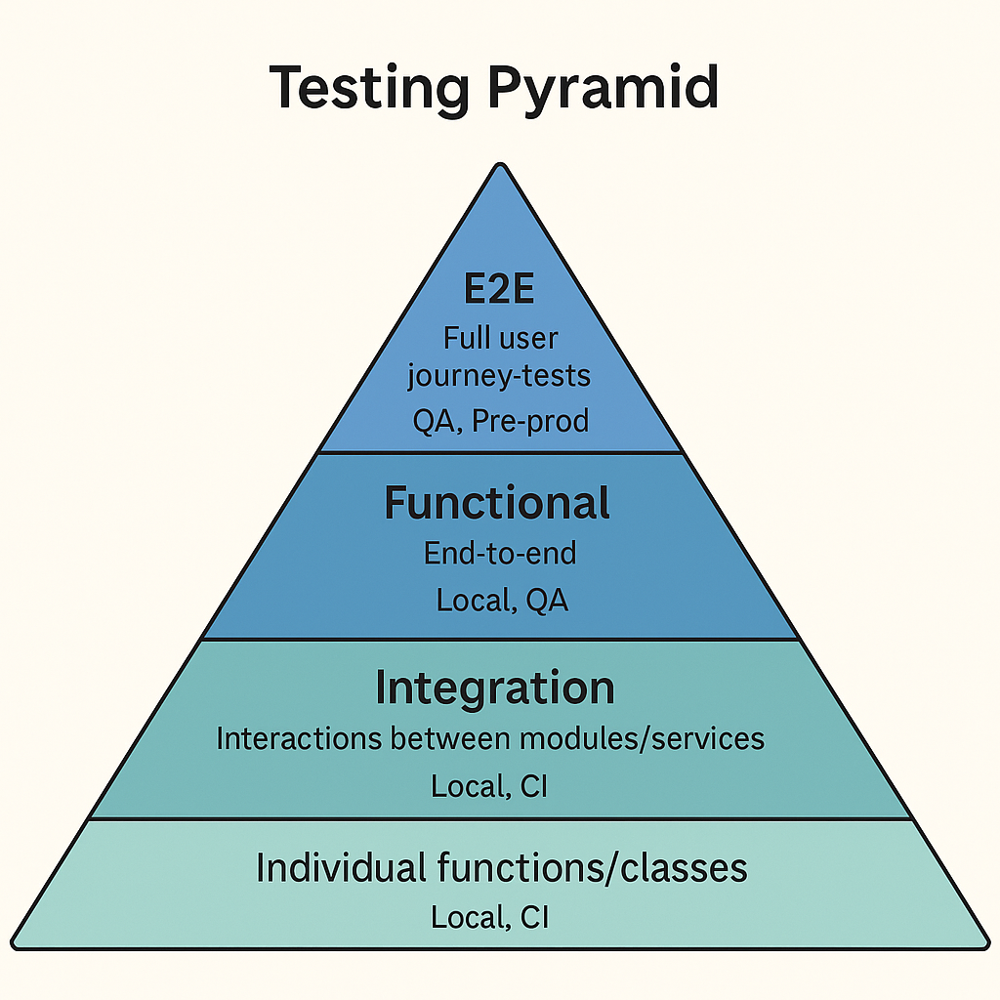

### 📘 `docs/architecture/testing.md` — Testing Architecture

# 🧪 Testing Architecture – Bluewater Framework

📄 **File:** `docs/architecture/testing.md`  
📅 **Status:** Draft  
🏷️ **Tags:** testing, QA, coverage  
🔖 **Version:** 0.1  
🌍 **Scope:** Define the testing layers, tools, and strategies used across the Bluewater Framework to ensure reliable, high-quality software  
🤝 **Contributors:** – Developers, QA engineers, CI/CD integrators  
👨‍💻 **Author:** Walter Torres  

---

> ### 🪶 **Bluewater Principle**  
> *Tests should be fast, faithful, and foundational — without them, trust is guesswork.*

---

## 📌 Purpose

This document describes how tests are structured, what layers exist, and how teams maintain quality across services and environments.

---

## 🧱 Testing Layers

| Layer         | Scope                                       | Runs In             |
|---------------|---------------------------------------------|---------------------|
| Unit          | Individual functions/classes                | Local, CI           |
| Integration   | Interactions between modules/services       | Local, CI           |
| Functional    | End-to-end functionality per feature        | Local, QA           |
| Contract      | Schema/API compatibility                    | CI, Gateway         |
| Smoke         | Deployment validation (sanity)              | CI, Staging         |
| E2E           | Full user journey tests (e.g. Cypress)      | QA, Pre-prod        |

<!-- Diagram: testing-pyramid -->


---

## 🛠️ Tools and Frameworks

| Purpose        | Tool                         |
|----------------|------------------------------|
| Unit testing   | Jest, Mocha                  |
| Integration    | Supertest, Axios             |
| Assertions     | Chai, Expect                 |
| E2E            | Cypress, Playwright          |
| Contract Tests | Postman, Pact                |
| Coverage       | Istanbul (nyc), Coverage CLI |

All test runners are NPM-based and available in `package.json`.

---

## 📂 Test File Structure

Recommended per-service layout:

```txt
/service/
├── src/
├── tests/
│   ├── unit/
│   ├── integration/
│   └── e2e/
└── .test.env
````

Each test suite should:

* Use its own env file
* Start/teardown any mocks or test DBs

---

## 🧪 Mocking and Fixtures

Mock external dependencies where needed using:

* `jest.mock(...)`
* Stubs or fakes for DB/cache
* Static JSON fixtures in `/tests/fixtures/`

Prefer integration tests over excessive mocking.

---

## 🔁 Test Execution in CI

CI will:

1. Lint and build services
2. Run all unit and integration tests
3. Deploy to test environment
4. Run smoke + contract tests
5. Optionally run full E2E on merge

Each step must pass to continue the pipeline.

---

## 🧼 Tenant-Safe Testing

In multi-tenant setups:

* Test data must be isolated per tenant
* Run with scoped tenants: `X-Tenant-ID: testA`
* Cleanup routines must reset only relevant data

Avoid using shared tenants between test runs.

---

## 📊 Coverage Metrics

Each service should:

* Generate coverage report (`/coverage/`)
* Target **80%+ line coverage**
* Include: statements, branches, functions, lines

Output integrated into CI artifacts and dashboards.

---

## 📚 Related Documents

* [CI/CD Pipeline](../deployment/ci-cd.md)
* [Service Architecture](services.md)
* [API Architecture](api.md)

---
