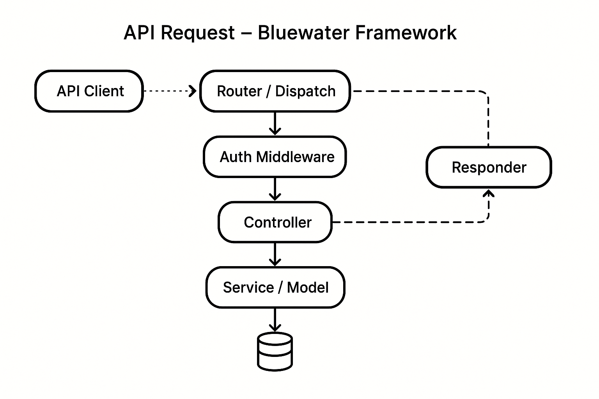

### 📘 `docs/architecture/api.md` — API Architecture

# 📡 API Architecture – Bluewater Framework

📄 **File:** `docs/architecture/api.md`  
📅 **Status:** Draft  
🏷️ **Tags:** api, routing, gateway  
🔖 **Version:** 0.1  
🌍 **Scope:** Define how APIs are structured, versioned, routed, and secured within the Bluewater Framework, and how they integrate with authentication, multi-tenancy, and documentation  
🤝 **Contributors:** – Backend developers, API consumers, DevOps engineers, and platform architects  
👨‍💻 **Author:** Walter Torres  

---

> ### 🪶 **Bluewater Principle**  
> *APIs are the front door to the platform — they must be stable, discoverable, and respectful of boundaries.*

---

## 📌 Purpose

This document describes the architectural design of the API layer within the Bluewater Framework. It covers the roles of the API Gateway, request flow, versioning strategies, and tenant-aware routing.

---

## 🚪 API Gateway Role

The API Gateway serves as the entry point for all incoming client requests.

### Responsibilities:
- Route requests to appropriate services
- Enforce authentication (JWT, OAuth2)
- Validate headers and query params
- Resolve tenant context
- Apply rate limiting and throttling
- Transform or aggregate requests if needed

---

## 🔄 Request Lifecycle

1. Client sends request to `https://api.domain.com`  
2. API Gateway intercepts and authenticates  
3. Tenant is resolved via subdomain or header  
4. Route matched to internal service endpoint  
5. Response is returned via Gateway with headers intact  



---


## 🧭 Routing Structure

Routing follows RESTful conventions and tenant-aware mapping:

- **Base Format**:
```

GET /v1/{resource}

```

- **Tenant-Scoped Example**:
```

GET /v1/users
Host: tenant1.api.domain.com

```

---

## 🧱 Versioning Strategy

### Semantic Versioning (SemVer-inspired)
- Major changes = new path prefix:
```

/v1/, /v2/, /v3/

````
- Deprecated versions may be aliased or removed based on policy.

### Internal vs Public Versions
- Public API: Stable, versioned `/v1/...`
- Internal API: Prefixed routes `/__internal/...` (no guarantee of stability)

---

## 🌍 Tenant-Aware API Design

Tenancy is enforced via:

 1. **Subdomain Routing**:
 - `tenant1.api.domain.com`
 - 
 2. **Header Resolution**:
 - `X-Tenant-ID: tenant1`

Token context and header values must match. Mismatches trigger `403 Forbidden`.

---

## 🔐 Security & Rate Limiting

### Authentication:
- Enforced via `Authorization: Bearer <JWT>` header
- Validated at Gateway and optionally by services

### Rate Limiting:
- Global per-IP or per-token quotas
- Optional tenant-specific quotas
- Configurable via middleware or reverse proxy (e.g., NGINX, Envoy)

---

## 📚 API Docs & Discovery

API contracts are defined via **OpenAPI (Swagger)**:

- Definitions stored in `/docs/openapi/`
- Served at `/docs/api/v1`, etc.
- Swagger UI auto-generates documentation for developers

### Dev Considerations:
- Use code annotations (e.g., JSDoc, Swagger decorators)
- Keep contracts version-controlled alongside service code

---

## 🛑 Error Handling Strategy

- Standardized error format:
```json
{
  "error": "InvalidToken",
  "message": "Authentication failed"
}
````

* HTTP Status Codes:

  * `400` – Bad Request
  * `401` – Unauthorized
  * `403` – Forbidden
  * `404` – Not Found
  * `422` – Validation Error
  * `500` – Internal Server Error

---

## 📚 Related Documents

* [Security Architecture](./security.md)
* [Deployment Strategy](./deployment.md)
* [Multi-Tenant Architecture](./multi-tenant.md)
* [Component Responsibilities](./components.md)

---
