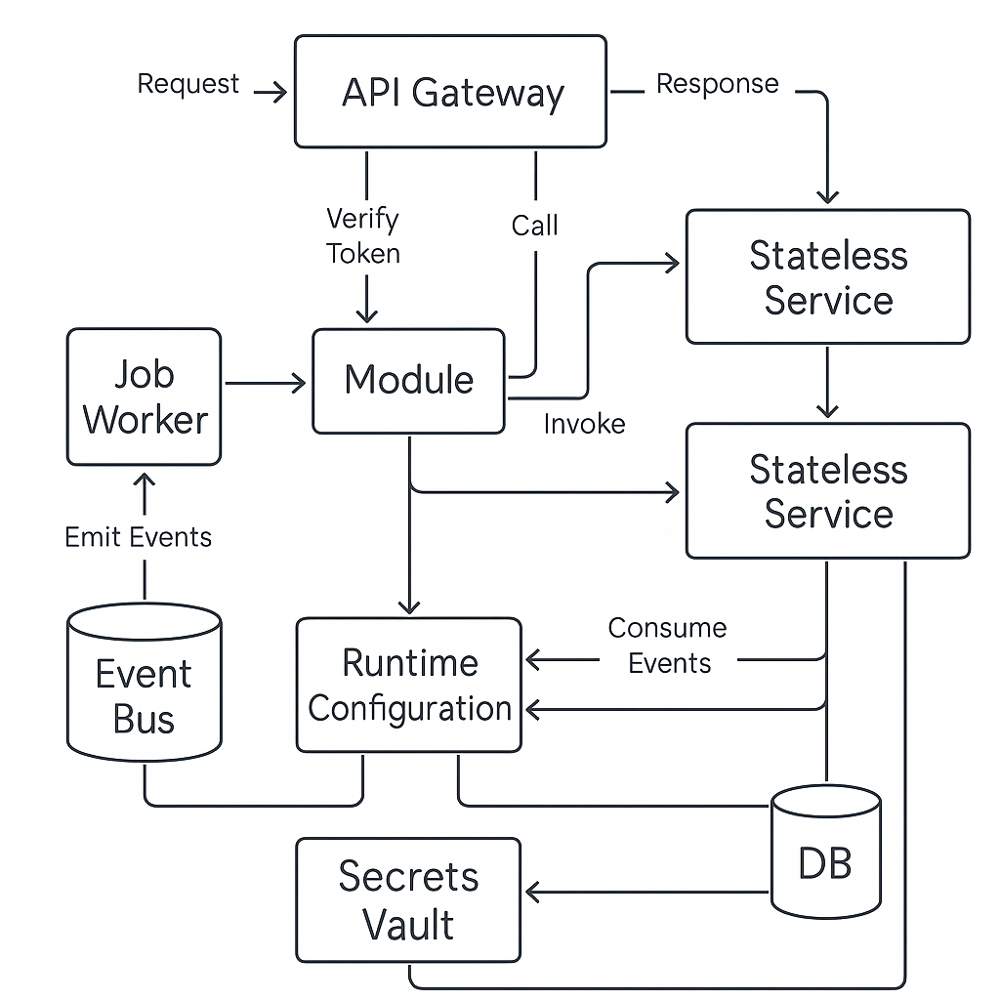

### 📘 `docs/architecture/components.md` — Core System Components

# 🧱 Core Components – Bluewater Framework

📄 **File:** `docs/architecture/components.md`  
📅 **Status:** Active  
🏷️ **Tags:** components, architecture, responsibilities  
🔖 **Version:** 1.0  
🌍 **Scope:** Identify and describe the fundamental components that form the Bluewater Framework and their architectural roles  
🤝 **Contributors:** – Platform architects, service developers, integration engineers  
👨‍💻 **Author:** Walter Torres  

---

> ### 🪶 **Bluewater Principle**  
> *Understand the pieces. Respect their contracts. Compose with intent.*

---

## 📌 Purpose

This document provides a high-level inventory of the primary components that comprise the Bluewater Framework. Each component encapsulates a functional area of the platform and defines a stable contract or behavior used by other services, APIs, or modules.

---

## 🧭 Component Inventory

| Component         | Purpose                                              | Examples                       |
|-------------------|------------------------------------------------------|--------------------------------|
| **API Gateway**   | Route, secure, and monitor ingress traffic           | NGINX, Express proxy, Envoy    |
| **Service**       | Stateless business logic, scaling units              | auth-service, file-service     |
| **Module**        | Pluggable domain logic reusable across services      | audit-logger, invoice-engine   |
| **Job Worker**    | Handles background tasks or CRON jobs                | email-job, cleanup-worker      |
| **Event Bus**     | Message passing and decoupled pub/sub                | NATS, RabbitMQ, internal queue |
| **Config Layer**  | Provides environment-based configuration             | env files, config modules      |
| **Secrets Vault** | Manages runtime-sensitive credentials and tokens     | Vault, AWS Secrets Manager     |
| **Database**      | Persistent storage tied to service domain            | PostgreSQL, MongoDB            |
| **Cache Layer**   | Accelerates reads and short-lived state              | Redis, Memcached               |
| **Observability** | Enables metrics, tracing, logging, and error capture | Prometheus, Grafana, ELK       |
| **Auth System**   | Provides token verification and role enforcement     | JWT, OAuth2, scopes            |

---

## 🔄 Component Interaction Flow

<!-- Diagram: component-interaction-overview -->

---

## 🧠 Responsibilities Overview

| Component     | Owns/Defines                      | Avoids                              |
|---------------|-----------------------------------|-------------------------------------|
| Service       | Its own logic + data              | Leaking cross-service assumptions   |
| Module        | Reusable logic + config contracts | Global state, persistent sessions   |
| API Gateway   | Routing + auth + rate-limiting    | Business logic, tenant-specific ops |
| Job Worker    | Async task lifecycle              | Direct user-facing responses        |
| Observability | Export logs, metrics, traces      | Business metrics or analytics       |

---

## 🔐 Trust & Boundary Rules

- Only the **gateway** and **auth service** should verify tokens  
- Internal services should not talk directly to each other except via contracts  
- Modules must **not share state** between tenants  
- Secrets may only be accessed through a **read-only vault client**  

---

## 🛠️ Blueprint References

- [`Service`](../blueprints/service/README.md)
- [`Module`](../blueprints/module/README.md)
- [`Event`](../blueprints/domain-event/README.md)
- [`API`](../platform/api/README.md)

---

## 📚 Related Documents

- [Architecture Overview](./overview.md)
- [Services](./services.md)
- [Mules](./modules.md)
- [Security](./security.md)

---
