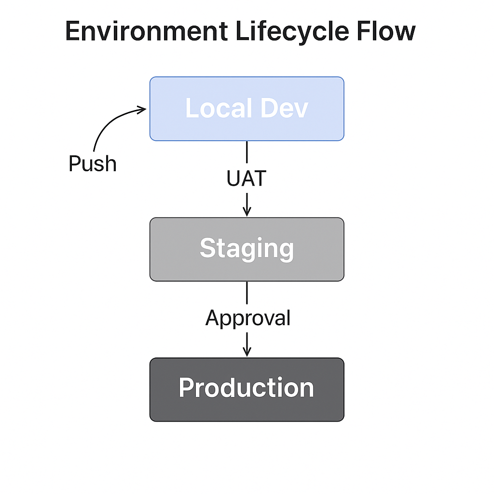

### 📘 `docs/architecture/environments.md` — Environment Strategy

# 🌐 Environment Architecture – Bluewater Framework

📄 **File:** `docs/architecture/environments.md`  
📅 **Status:** Active  
🏷️ **Tags:** environments, lifecycle, deployment, devops  
🔖 **Version:** 1.0  
🌍 **Scope:** Define the roles, behaviors, boundaries, and lifecycle of application environments in the Bluewater Framework  
🤝 **Contributors:** – DevOps, developers, QA engineers, security team  
👨‍💻 **Author:** Walter Torres  

---

> ### 🪶 **Bluewater Principle**  
> *Each environment should behave like production—except when it shouldn’t.*

---

## 📌 Purpose

This document outlines how Bluewater environments are structured, what each is responsible for, and how they are isolated, governed, and promoted through the delivery lifecycle.

---

## 🧭 Environment Matrix

| Environment    | Purpose              | Branch Source | Access         | Data & Config        |
|----------------|----------------------|---------------|----------------|----------------------|
| **Local**      | Dev sandbox          | Any           | Developer only | Local mock or `.env` |
| **UAT**        | Internal QA/test     | Feature/test  | Internal team  | Partial seed         |
| **Staging**    | Pre-prod validation  | `main`        | Authenticated  | Full replica         |
| **Production** | Live customer-facing | `main`        | Restricted     | Hardened, secure     |

---

## 🔄 Environment Lifecycle Flow

1. **Local Dev** → Push →  
2. **UAT Deploy** (CI auto)  
3. Merge → `main` →  
4. **Staging Deploy**  
5. Approval →  
6. **Production Deploy**

<!-- Diagram: environment-lifecycle-flow -->

---

## 🛠️ Environment Controls

| Control         | Local | UAT | Staging | Prod |
|-----------------|-------|-----|---------|------|
| Lint/Tests Req  | ✅     | ✅   | ✅       | ✅    |
| Token Required  | ❌     | ✅   | ✅       | ✅    |
| Real Data       | ❌     | ❌   | ✅       | ✅    |
| Observability   | ✅     | ✅   | ✅       | ✅    |
| External Access | ❌     | ✅   | ✅       | ✅    |
| Manual Trigger  | ❌     | ✅   | ✅       | ✅    |

---

## 🔐 Security Practices by Environment

- **Local:** No secrets loaded from vault  
- **UAT:** Test tokens only, logs scrubbed  
- **Staging:** Simulated production access  
- **Prod:** Secrets encrypted, readonly audit  

Secrets and configuration are layered and inherited via the config loader.

---

## 📊 Telemetry Expectations

Each environment reports:

- Request metrics  
- Error rates  
- Traces (staging/prod only)  
- Logs tagged by environment label

All environments expose `/health` and `/metrics` endpoints.

---

## 📚 Related Documents

- [Deployment Strategy](./deployment.md)  
- [Secrets and Config](./secrets.md)  
- [Observability](./observability.md)  
- [Architecture Overview](./overview.md)  

---
