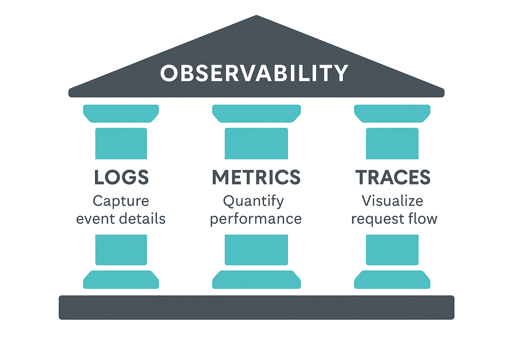
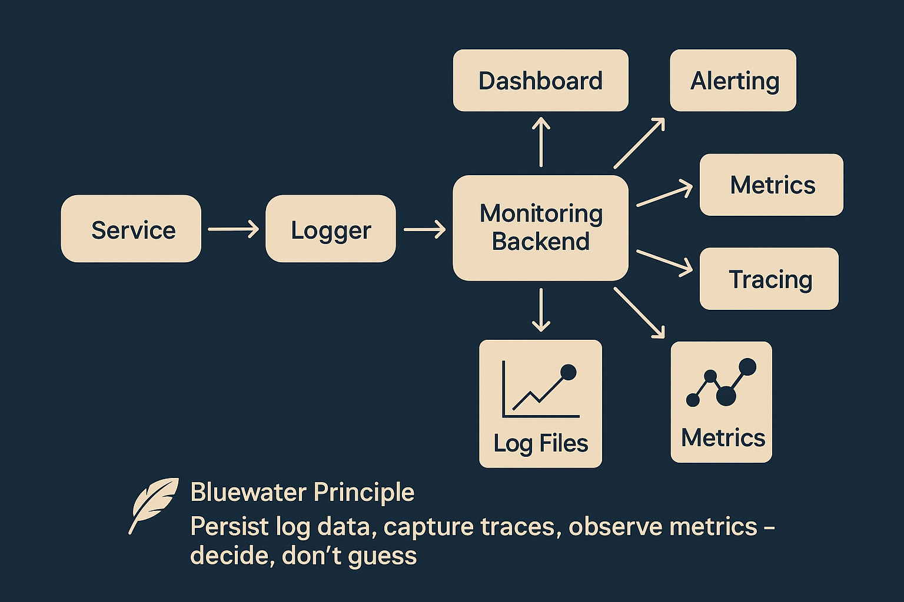

### 📘 `docs/architecture/observability.md` — Observability Architecture

# 🔍 Observability Architecture – Bluewater Framework

📄 **File:** `docs/architecture/observability.md`  
📅 **Status:** Draft  
🏷️ **Tags:** observability, logging, metrics, tracing  
🔖 **Version:** 0.1  
🌍 **Scope:** Define how observability is achieved across Bluewater services through structured logs, metrics, traces, and alerting systems  
🤝 **Contributors:** – SREs, DevOps engineers, backend developers  
👨‍💻 **Author:** Walter Torres  

---

> ### 🪶 **Bluewater Principle**  
> *If you can't observe it, you can't trust it. Insight is the foundation of uptime.*

---

## 📌 Purpose

This document outlines how the Bluewater Framework implements observability through standardized logs, real-time metrics, distributed traces, and automated alerting.

---

## 📊 Observability Pillars

Observability is built on three key signals:

| Pillar  | Purpose                | Tooling Examples             |
|---------|------------------------|------------------------------|
| Logs    | Capture event details  | Winston, Logstash, Fluentbit |
| Metrics | Quantify performance   | Prometheus, Grafana          |
| Traces  | Visualize request flow | OpenTelemetry, Jaeger        |

<!-- Diagram: observability-pillars -->


---

## 📋 Log Structure and Delivery

### Structure:
- Format: JSON  
- Levels: `debug`, `info`, `warn`, `error`, `fatal`  
- Context fields:
  - `timestamp`, `service`, `tenant`, `trace_id`, `user_id`

### Delivery:
- Local dev: stdout + file  
- CI/staging: stream to ELK stack  
- Production: stream via Fluentbit → Logstash → Elasticsearch

```json
{
  "timestamp": "2025-06-01T10:42:00Z",
  "level": "info",
  "service": "auth-service",
  "tenant": "clientA",
  "trace_id": "abc-123",
  "message": "Token validated"
}
````

---

## 📈 Metrics Collection

### Metrics Types:

* System: CPU, memory, disk
* App: request count, latency, error rate
* Custom: tenant-specific or domain-specific (e.g., "invoices processed")

### Export Format:

* Prometheus scrape endpoint (`/metrics`)
* Use counters, gauges, histograms, summaries

Dashboards:

* Grafana: global + per-service views
* Support for per-tenant filters

---

## 🧵 Distributed Tracing

### Purpose:

* Trace requests across services
* Identify bottlenecks or errors in the flow
* Correlate logs and metrics via `trace_id`

### Implementation:

* OpenTelemetry SDK
* Instrument HTTP clients, DB drivers, queues
* Export spans to:

  * Jaeger (local/test)
  * Grafana Tempo (prod)

Trace identifiers must flow with each request:

```http
X-Trace-ID: 6c927d12-...
```

<!-- Diagram: distributed-tracing-flow -->



---

## 🚨 Alerting and Notifications

Alerting is configured based on metrics and error logs.

### Channels:

* Email, Slack, PagerDuty
* Incident Webhooks

### Types:

* High error rates (500s, auth failures)
* Latency spikes
* Service downtime (via `/health`)

Policy:

* Alert severity: `warn`, `critical`, `page`
* Escalation chain for on-call engineers

---

## 🛠️ Tooling and Integration

| Layer    | Tool                    |
|----------|-------------------------|
| Logs     | Winston, Fluentbit, ELK |
| Metrics  | Prometheus, Grafana     |
| Tracing  | OpenTelemetry, Jaeger   |
| Alerting | Alertmanager, PagerDuty |

All services must expose `/health` and `/metrics`.

---

## 📚 Related Documents

* [Security Architecture](./security.md)
* [Service Architecture](./services.md)
* [Deployment Strategy](./deployment.md)

---
