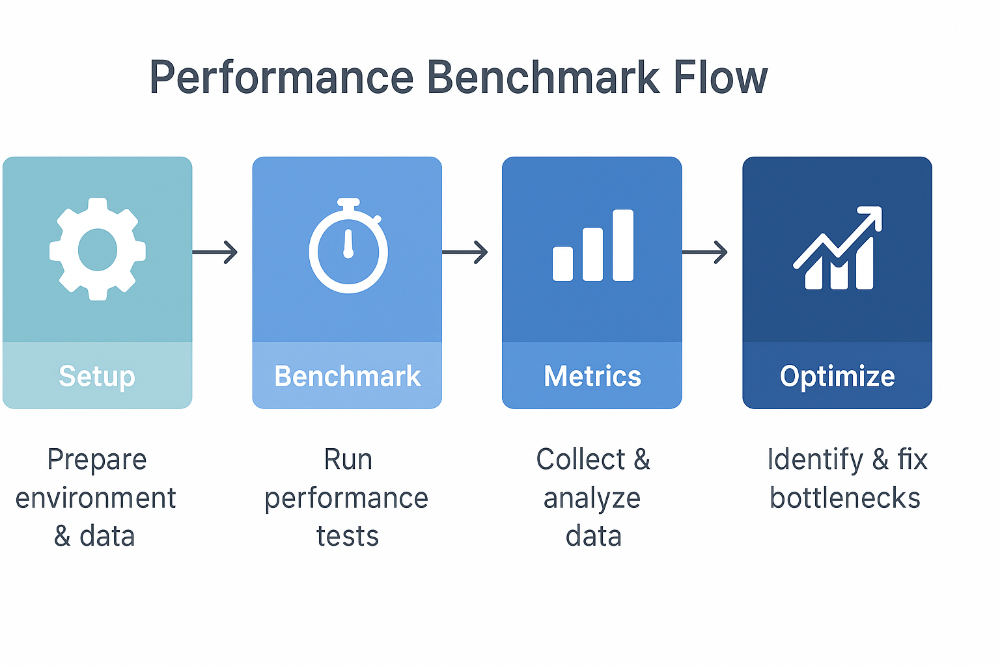

### 📘 `docs/architecture/performance.md` — Performance Architecture

# ⚡ Performance Strategy – Bluewater Framework

📄 **File:** `docs/architecture/performance.md`  
📅 **Status:** Draft  
🏷️ **Tags:** performance, benchmarks, scalability  
🔖 **Version:** 0.1  
🌍 **Scope:** Define performance expectations, metrics, and optimization strategies across services in the Bluewater Framework  
🤝 **Contributors:** – Developers, DevOps, SREs, QA engineers  
👨‍💻 **Author:** Walter Torres  

---

> ### 🪶 **Bluewater Principle**  
> *Measure before you optimize. Predictability beats speed when systems scale.*

---

## 📌 Purpose

This document outlines the performance posture of Bluewater services—targeting consistent response times, predictable scaling, and operational metrics that support quality of service (QoS) at scale.

---

## ⏱️ Baseline Performance Targets

| Category          | Target                 |
|-------------------|------------------------|
| API Latency (P95) | ≤ 250ms                |
| Auth Token Verify | ≤ 50ms                 |
| DB Query (avg)    | ≤ 100ms                |
| Cold Boot Time    | ≤ 3 seconds            |
| Message Queue Lag | ≤ 500ms                |
| Health-check TTL  | < 1 second (readiness) |

Targets may vary slightly per service class (core, edge, batch).

---

## 🔁 Load Profiles

Three tiers of expected load:

| Tier       | Users  | Req/sec | Notes                      |
|------------|--------|---------|----------------------------|
| Dev/UAT    | < 10   | < 5     | No load optimization       |
| Staging    | 10–100 | < 20    | Sanity + stress testing    |
| Production | 1K+    | 100+    | SLA monitored, autoscaling |

---

## 📉 Bottleneck Classifications

Common sources of slowdowns:

- DB n+1 queries  
- External API retries  
- High object graph hydration  
- Synchronous I/O at scale  
- Per-request config or token parsing

Mitigation:
- Caching (memory, Redis)  
- Background workers for async ops  
- Indexed, bounded DB queries  
- Slim API payloads  

---

## ⚙️ Instrumentation Strategy

All performance-critical services must emit:

- Request duration (`histogram`)  
- Error rate by route/code (`counter`)  
- Resource consumption (CPU/mem via node exporter)  
- Queue metrics (depth, lag)

Metrics must be exposed via `/metrics` and tagged by `env`, `service`, and `tenant`.

---

## 📈 Benchmarking & Load Testing

Each service should have a `load/` folder with:

- `k6` or `Artillery` scripts  
- Realistic data + auth tokens  
- CI-compatible test mode

Benchmarks must be:
- Repeatable  
- Versioned  
- Run pre-release (especially breaking changes)

<!-- Diagram: performance-benchmark-flow -->

---

## 📦 Scaling Principles

- Stateless services should scale horizontally  
- Use autoscaling based on:
  - Request volume
  - CPU/memory thresholds
  - Queue depth or lag
- Prefer vertical isolation (per tenant/group)

Avoid:
- Session stickiness  
- Global mutex locks  
- Large shared caches

---

## 📚 Related Documents

- [Deployment Strategy](./deployment.md)  
- [Observability](./observability.md)  
- [Testing Architecture](./testing.md)  
- [Service Architecture](./services.md)  

---
