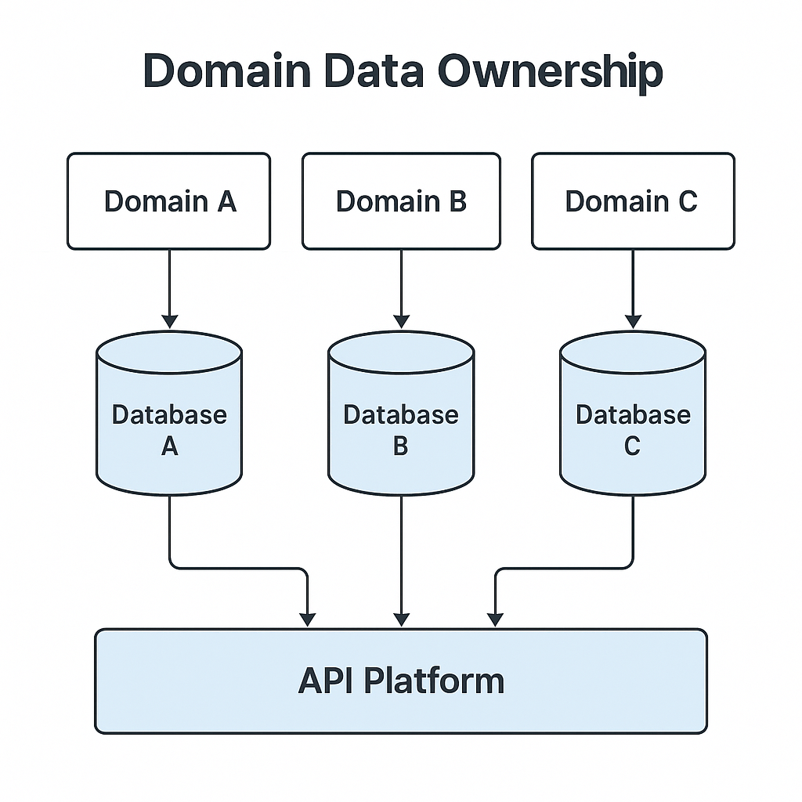
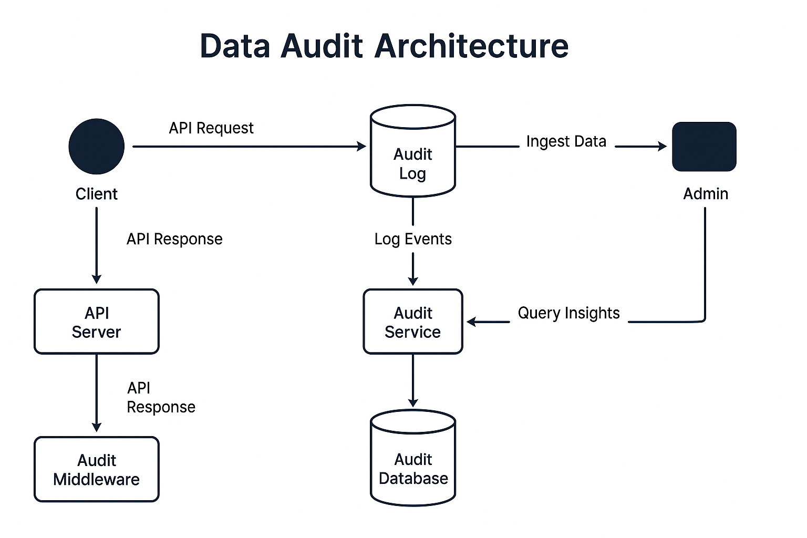

### 📘 `docs/architecture/data.md` — Data Architecture

# 🧮 Data Architecture – Bluewater Framework

📄 **File:** `docs/architecture/data.md`  
📅 **Status:** Draft  
🏷️ **Tags:** data, storage, tenants  
🔖 **Version:** 0.1  
🌍 **Scope:** Define the structure, partitioning, and ownership of data across services and tenants in the Bluewater Framework  
🤝 **Contributors:** – Backend engineers, data architects, platform developers  
👨‍💻 **Author:** Walter Torres  

---

> ### 🪶 **Bluewater Principle**  
> *Data should reflect intent — separated when necessary, unified when meaningful.*

---

## 📌 Purpose

This document establishes how data is designed, stored, and governed across the Bluewater platform. It defines the service and tenant data boundaries, schema patterns, and operational expectations for modeling, migration, and reporting.

---

## 🧭 Domain-Oriented Ownership

Each domain service owns and manages its own data store. This ensures:
- Encapsulation of business logic
- Independent scaling and deployment
- Controlled access to internal models

Avoid cross-service foreign key constraints. Instead, rely on:
- UUID references
- Eventual consistency
- API-based lookups

<!-- Diagram: domain-data-ownership -->

---

## 🧱 Tenant-Aware Partitioning

Data isolation depends on deployment mode:

| Mode              | Strategy                         |
|-------------------|----------------------------------|
| Shared DB         | `tenant_id` column in each table |
| Schema-per-tenant | Isolated schema namespaces       |
| DB-per-tenant     | Separate databases per tenant    |

Use `tenant_id` in all queries to enforce logical separation.

---

## 🧬 Schema Design Patterns

Design for flexibility:
- Use JSON columns for extensibility (sparingly)
- Normalize where appropriate, denormalize for reads
- Add `created_by`, `updated_by`, `deleted_at` columns for traceability

Table conventions:
- Singular names: `user`, `invoice`
- Snake_case fields: `user_id`, `created_at`
- Composite indexes for performance (`tenant_id`, `status`)

---

## 📖 Read Models and Projections

For performance or analytics:
- Create read-optimized tables
- Use materialized views or projections
- Consider ElasticSearch or Redis for derived data

Avoid exposing write models directly in public APIs.

---

## 🔁 Migrations and Versioning

Use a tool like `Knex`, `Flyway`, or `Prisma`:
- Version control every migration
- One service = one migration timeline
- Never auto-apply in production

For multi-tenant schemas:
- Loop migrations across schemas
- Track applied versions per schema or tenant

---

## 📊 Reporting and Analytics

Centralized reporting can read from:
- Replicated read-only DBs
- Data lakes (future support)
- Periodic exports (e.g., CSV)

Ensure:
- Sensitive fields are redacted
- Analytics respect tenant boundaries

---

## 🕵️ Audit and History

Enable logging for:
- Record changes
- User activity
- Security events

Use changelogs or an event stream (future).

<!-- Diagram: data-audit-architecture -->

---

## 📚 Related Documents

- [Component Responsibilities](./components.md)  
- [Multi-Tenant Architecture](./multi-tenant.md)  
- [Security Architecture](./security.md)  
