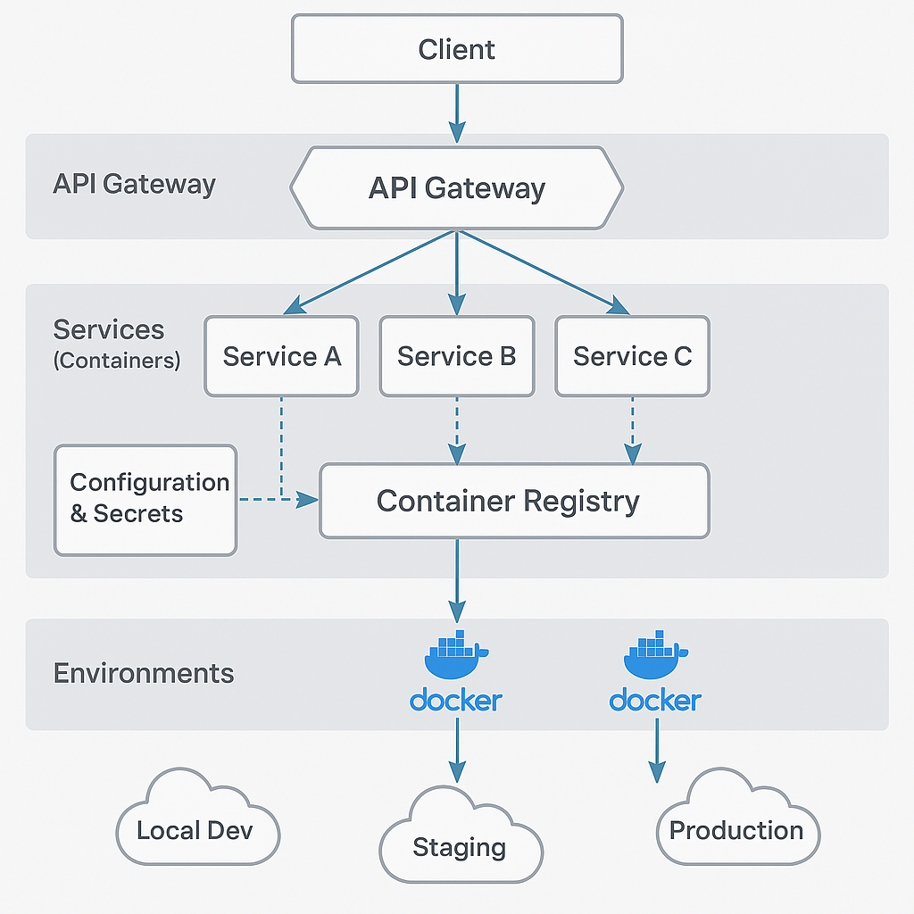

### 📘 `docs/architecture/deployment.md` — Strategic Deployment Overview

# 🚧 Deployment Strategy – Bluewater Framework

📄 **File:** `docs/architecture/deployment.md`  
📅 **Status:** Active  
🏷️ **Tags:** deployment, environments, strategy, automation  
🔖 **Version:** 1.0  
🌍 **Scope:** Provide a high-level deployment architecture for Bluewater Framework services, including environment tiers, delivery flows, and automation points  
🤝 **Contributors:** – Developers, DevOps engineers, release managers  
👨‍💻 **Author:** Walter Torres

---

> ### 🪶 **Bluewater Principle**
> *Deployment should be boring—because every piece is deliberate and observable.*

---

## 📌 Purpose

This document outlines the strategic deployment model used in the Bluewater Framework. It explains how services move from code to production, how environments are structured, and what controls and signals are embedded in the pipeline.

---

## 🌐 Environment Tiers

| Environment | Purpose                 | Characteristics                  |
|-------------|--------------------------|----------------------------------|
| **Local**   | Developer sandbox        | `.env.local`, no auth, mocks     |
| **UAT**     | Internal testing & QA    | Feature branches, seeded data    |
| **Staging** | Pre-production shadow    | Full config, auth, observability |
| **Production** | Live platform       | Hardened, locked, monitored      |

Each environment uses isolated secrets and config layers.

---

## 🏗️ Deployment Architecture

- Services deployed as containerized units (e.g., Docker)
- Orchestrated via Compose, ECS, or Kubernetes
- Config and secrets injected at runtime
- Healthcheck & readiness probes required
- Routing handled by central API Gateway

<!-- Diagram: deployment-architecture -->

---

## 🔄 Deployment Flow Summary

1. **Code pushed** → Git triggers CI/CD pipeline
2. **Build phase**: test, lint, compile, create Docker image
3. **Artifact** is tagged and pushed to registry
4. **Deploy** to UAT or staging based on branch rules
5. **Smoke tests** and alerts run post-deploy
6. **Promotion** to production via protected pipeline step

Pipeline failures halt automatically and require review.

---

## 🔐 Access and Gatekeeping

- UAT and Staging allow manual redeploys
- Production deploys require merge to `main` + manual approval
- Secrets pulled at runtime from Vault or Secret Manager
- CI tokens rotated and scoped per environment

---

## 📦 Configuration Strategy

- `.env.schema` defines all supported vars
- Per-env overrides: `.env.uat`, `.env.prod`
- Read at runtime via platform config loader
- Sensitive values never stored in Git

---

## 🔁 Rollback and Recovery

- Each deploy creates a versioned artifact
- Rollbacks = re-deploy previous version from tag
- Service logs and traces available immediately post-deploy
- Queued jobs or pending requests handled gracefully

---

## 📚 Related Documents

- [Service Architecture](./services.md)
- [CI/CD Pipeline](../deployment/ci-cd.md)
- [Secrets Management](./secrets.md)
- [Observability](./observability.md)  

---
