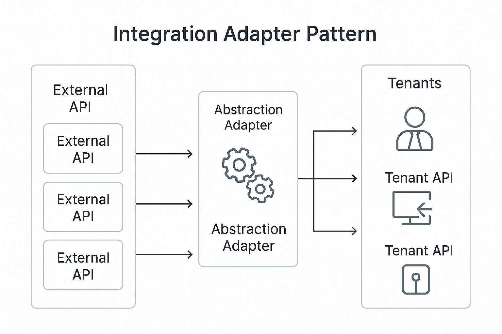

Great. I’ll now generate the full `docs/architecture/integration.md` document, covering integration strategy with external systems, patterns, and best practices. Diagram placeholders will be included where useful.


Here is the complete `docs/architecture/integration.md` document, ready for your Bluewater documentation suite:

````markdown
### 📘 `docs/architecture/integration.md` — External Integration Architecture

# 🔗 Integration Architecture – Bluewater Framework

📄 **File:** `docs/architecture/integration.md`  
📅 **Status:** Draft  
🏷️ **Tags:** integration, systems, adapters  
🔖 **Version:** 0.1  
🌍 **Scope:** Define how Bluewater services integrate with external systems such as payment providers, identity platforms, and third-party APIs  
🤝 **Contributors:** – Developers implementing or configuring integrations with outside platforms  
👨‍💻 **Author:** Walter Torres  

---

> ### 🪶 **Bluewater Principle**  
> *Treat all external systems as unreliable—even if they never fail.*

---

## 📌 Purpose

This document outlines the design principles, architecture, and safeguards around integrating third-party platforms with Bluewater services. The goal is to ensure integrations are modular, resilient, and secure.

---

## 🧱 Common Integration Scenarios

| Integration Type     | Examples                             |
|----------------------|--------------------------------------|
| Payments             | Stripe, Square, Braintree            |
| Authentication       | Auth0, Google, SAML, OIDC            |
| Communication        | Twilio, SendGrid, Mailgun            |
| CRM / ERP / Support  | Salesforce, HubSpot, Zendesk         |
| Analytics / Tracking | Segment, GA, Mixpanel                |

---

## 🧩 Adapter Pattern for External APIs

External services are accessed via **adapters** that abstract transport and vendor-specific logic:

```txt
/app/adapters/
├── stripe.js
├── sendgrid.js
└── auth0.js
````

Each adapter exposes:

* A consistent interface
* Retry, timeout, and fallback logic
* Logging and metrics around requests

<!-- Diagram: integration-adapter-pattern -->



---

## 🔄 Retry & Failure Patterns

Integrations should treat remote services as **eventually unreliable**. Best practices include:

* Circuit breakers to prevent cascading failure
* Retries with backoff (max 3 attempts)
* Timeouts per request (e.g., 3s)
* Fallback options or degraded modes

Logging should capture:

* Request duration
* Retry count
* Failure reason

---

## 🔐 Authentication with Providers

Each integration should:

* Store credentials/secrets via environment config
* Rotate tokens using scheduled tasks
* Use scoped credentials when available

Secrets are managed through the same mechanism as internal config:

```js
process.env.SENDGRID_API_KEY
```

---

## 📡 Webhooks and Callbacks

For incoming events (e.g., Stripe webhook):

* Use a dedicated route: `/webhooks/stripe`
* Validate signatures
* Respond quickly (ack + queue work)

Webhook workers should be idempotent and stateless.

---

## 📦 Data Isolation & Compliance

If integrations store or process tenant/user data:

* Ensure PII is only handled by compliant providers
* Isolate per-tenant interactions when supported
* Log integration context (tenant, event, response)

---

## 🧪 Testability

Integration code should support mocking:

* Provide fake adapters for local or CI runs
* Use record/replay patterns in some cases (e.g., Polly.js)

Avoid running real calls in CI or dev unless scoped by explicit test credentials.

---

## 📚 Related Documents

* [Modules Architecture](./modules.md)
* [Secrets & Config Management](./secrets.md)
* [Security Architecture](./security.md)
* [Deployment Strategy](./deployment.md)

---
