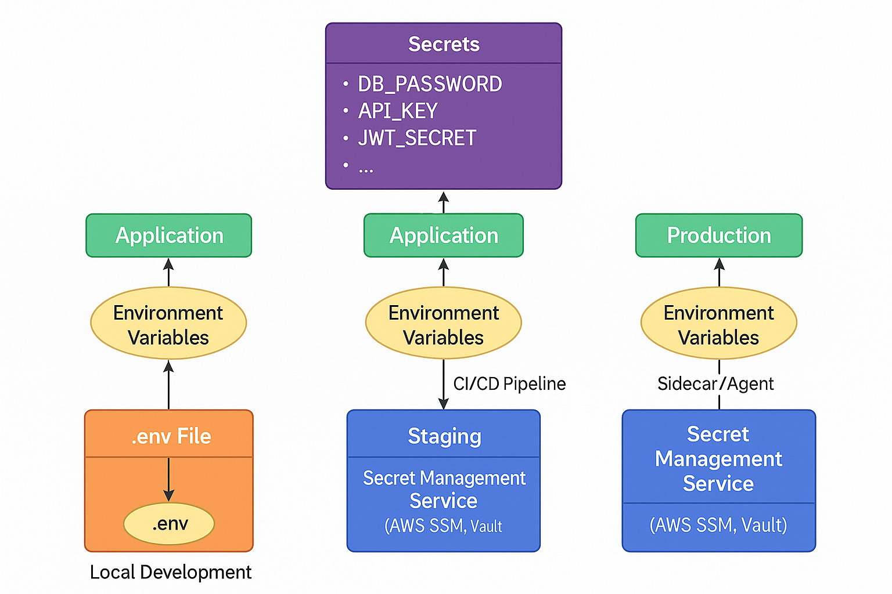

### 📘 `docs/architecture/secrets.md` — Secrets & Configuration Management

# 🔐 Secrets & Configuration – Bluewater Framework

📄 **File:** `docs/architecture/secrets.md`  
📅 **Status:** Draft  
🏷️ **Tags:** secrets, config, security  
🔖 **Version:** 0.1  
🌍 **Scope:** Define how sensitive configuration values and secrets are securely managed across all environments in the Bluewater Framework  
🤝 **Contributors:** – DevOps, platform engineers, and developers managing environment configuration and secret injection  
👨‍💻 **Author:** Walter Torres  

---

> ### 🪶 **Bluewater Principle**  
> *Security through simplicity — the safest secrets are those that are handled quietly and automatically.*

---

## 📌 Purpose

This document outlines the strategies and mechanisms used to manage secrets and sensitive configuration across all environments of the Bluewater Framework, ensuring confidentiality, integrity, and availability.

---

## 🔐 What Qualifies as a Secret?

Examples of secrets include:
- Auth token signing keys  
- API keys or credentials  
- Database usernames and passwords  
- Encryption keys  
- Per-tenant overrides (if applicable)  
- External service tokens (e.g., Stripe, Twilio)

---

## 🗂️ Storage Models by Environment

### Local Development

- Secrets stored in `.env` files at the project root
- Managed via `.env.example` and `.gitignore`
- Loaded into runtime via tools like `dotenv`

### Staging & Production

- Secrets stored in managed secret systems:
  - **AWS SSM Parameter Store**
  - **HashiCorp Vault**
  - **Doppler**, **1Password Secrets Automation**, etc.
- Pulled into runtime using:
  - Deployment pipeline injectors (CI/CD)
  - Sidecar containers or secret agents
  - Runtime API access with RBAC

---

## 🗂️ Storage Models by Environment

...



---

## ⚙️ Environment Variable Injection

Secrets should be loaded into the environment at runtime:

```sh
DB_PASSWORD=${DB_PASSWORD}
JWT_SECRET=${JWT_SECRET}
````

Accessed in code:

```js
const jwtSecret = process.env.JWT_SECRET;
```

Do not hardcode secrets or include fallback values in production code.

---

## 🧭 Tenant-Specific Secrets

In multi-tenant mode, some secrets may be scoped per tenant:

* `clientA.jwt.secret`
* `clientB.db.password`

### Management Approaches

1. **Centralized Key Store (Recommended)**

   * Map secrets using tenant identifiers
   * Store encrypted and scoped per tenant

2. **Per-Tenant Config Files (Riskier)**

   * If used, ensure strict path isolation (`/app/clientA/config/`)
   * Use a separate secret loader per tenant context

---

## 🛑 Anti-Patterns to Avoid

| ❌ Bad Practice                  | ✅ Safer Alternative                    |
|---------------------------------|----------------------------------------|
| Committing `.env` to Git        | Use `.gitignore` + `.env.example`      |
| Embedding keys in source code   | Use `process.env` or secret injectors  |
| Sharing secrets over chat       | Use password managers or vaults        |
| Long-lived tokens               | Rotate secrets and use expiring tokens |
| Uniform secrets for all tenants | Use tenant-scoped configurations       |

---

## ✅ Operational Best Practices

* **Version secrets**: Enable rollbacks and audit history
* **Limit access**: Use least privilege policies
* **Audit use**: Track secret access and changes
* **Rotate regularly**: Use automation to cycle keys and tokens
* **Validate presence**: Fail fast if secrets are missing or misconfigured

---

## 📚 Related Documents

* [Security Architecture](./security.md)
* [Multi-Tenant Architecture](./multi-tenant.md)
* [Deployment Strategy](./deployment.md)

---
